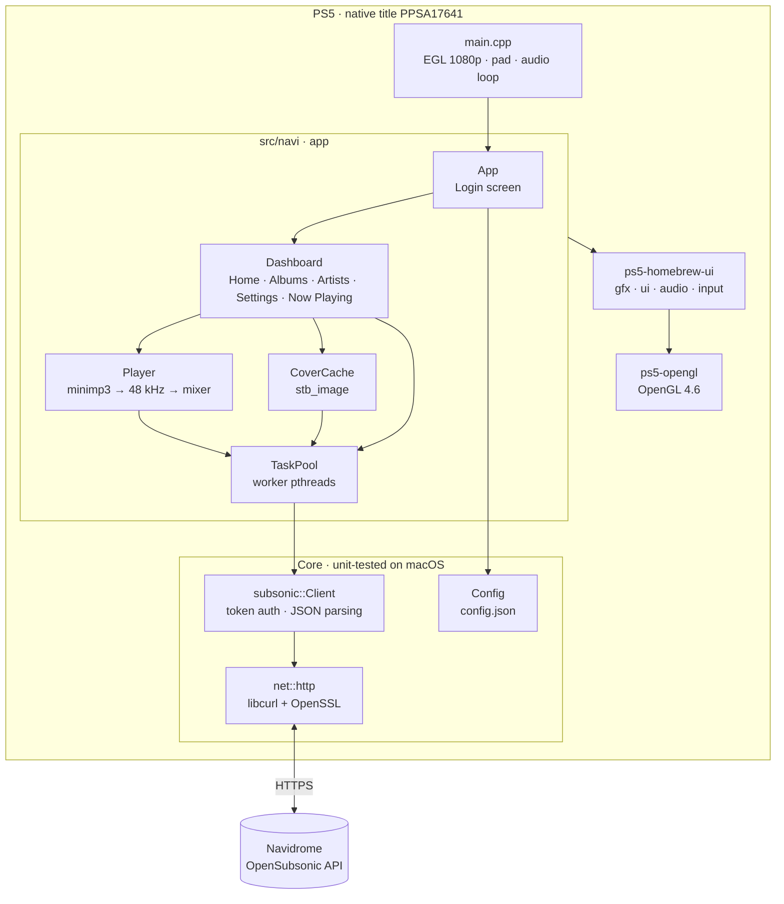

<div align="center">


# SymphonyStation5

**A native Navidrome music client for the PlayStation 5.**

Stream your self-hosted music library from the couch, with a controller-first UI rendered in OpenGL 4.6.

[](LICENSE)


[Features](#features) ·
[Install](#installing-a-release) ·
[Build](#building-from-source) ·
[Architecture](#architecture) ·
[Debugging](#debugging-on-hardware) ·
[License](#license)

</div>

---

> [!IMPORTANT]
> SymphonyStation5 needs a reachable
> [Navidrome](https://www.navidrome.org/) (or any OpenSubsonic-compatible)
> server. It is not affiliated with Sony Interactive Entertainment or the
> Navidrome project.

## Features

- 🏠 **Dashboard** with five tabs you switch with **L1 / R1**: *Home*, *Albums*,
  *Artists*, *Settings* and *Now Playing*.
- 🖼️ **Album art everywhere.** The server scales covers to one fixed size;
  they are decoded off the main thread and cached as textures.
- 📻 **Home shelves** for *Recently played* and *Recently added* albums.
- ▶️ **Streaming playback.** Songs arrive as MP3 from the server,
  are decoded with minimp3 on a dedicated thread, resampled to 48 kHz and fed
  to the audio mixer. Play/pause, next/previous and seeking are supported.
- 📈 **Scrobbling.** Plays are reported to Navidrome, so *Recently played*
  stays accurate across all your clients.
- 🔐 **Secure login** with Subsonic token auth (`md5(password + salt)`, fresh
  salt per request) over HTTPS via libcurl + OpenSSL.
- 💾 **Remembers you.** The login is saved to title-local storage, so later
  launches go straight to your library.
- 🎮 **Controller-first UI** built on
  [ps5-homebrew-ui](https://github.com/blackbearreloaded/ps5-homebrew-ui)
  (Fresh theme), with an on-screen keyboard, UI sounds and rumble feedback.

## Controls

| Button | Action |
| --- | --- |
| **D-pad / left stick** | Move focus |
| **✕ Cross** | Select / confirm |
| **◯ Circle** | Back |
| **L1 / R1** | Previous / next tab |

## Requirements

- Navidrome, or any server that implements the
  [OpenSubsonic API](https://opensubsonic.netlify.app/), reachable from the
  console's network.

## Installing a release

1. Download `PPSA17641.zip` from the
   [Releases](https://github.com/TsvetomirGT/SymphonyStation5/releases) page.
2. Unzip it and copy the `PPSA17641/` folder to `/data/homebrew/` on the
   console, for example over FTP.
3. The **SymphonyStation5** tile appears on the home screen.
4. Launch it and enter your server URL, username and password.

> [!TIP]
> You can pre-seed the login by placing a `config.json` next to `eboot.bin`:
>
> ```json
> {
>   "server": "https://music.example.com",
>   "username": "alice",
>   "password": "correct horse battery staple"
> }
> ```

## Building from source

Development is **console-first**. The UI needs OpenGL 4.5+, which macOS lacks,
so it only runs on the PS5. The platform-independent core (Subsonic client,
HTTP, config, utilities) is unit-tested on the Mac.

### Host prerequisites (macOS)

```sh
brew install llvm@18 coreutils findutils gnu-sed bash ninja ccache pkgconf curl
```

The Makefile puts the GNU tools and LLVM 18 first on `PATH`, so you don't need
to change your shell setup. Pinned dependencies are fetched automatically into
the git-ignored `.deps/` directory:

| Dependency | Version | Purpose |
| --- | --- | --- |
| PS5 payload SDK | v0.42 | Toolchain headers and import stubs |
| PacBrew | v0.40.2 | libcurl, OpenSSL, zstd, libpsl |
| ps5-opengl SDK | 1.0.0 | OpenGL 4.6 on the PS5 GPU (Mesa) |
| compiler-rt builtins | LLVM 18 (x86_64) | Runtime builtins Homebrew's clang lacks |
| zlib | 1.3.2 | Compression for curl |

### Make targets

```sh
make test                          # build + run the core unit tests on macOS
make app                           # build the native title -> dist/PPSA17641/
make app-deploy PS5_HOST=<ip>      # build + upload to /data/homebrew/PPSA17641
make app-launch PS5_HOST=<ip>      # start the title remotely via websrv
make klog PS5_HOST=<ip>            # stream the kernel log (app logs + crashes)
make clean                         # remove build/ and dist/
```

A typical edit-run loop:

```sh
make app-deploy app-launch PS5_HOST=192.168.1.50 && make klog PS5_HOST=192.168.1.50
```

> [!NOTE]
> `make app-launch` often reports HTTP 503 even when the title started.
> Check `make klog` for `[NAVI]` lines.

## Architecture



Each frame, `main.cpp` runs `app.update` → play UI cues → `app.compose` →
`renderer.present` → `display.swap`. All network I/O happens on worker
threads with 1 MiB stacks, because the console's default thread stacks are
too small for TLS.

### Repository layout

```text
src/
├── navi/          The app: login, dashboard, player, cover cache, task pool
├── subsonic/      OpenSubsonic client (token auth, JSON parsing)    ┐
├── net/           Blocking HTTP GET on libcurl                       │ core,
├── util/          File I/O, MD5, UTF-8 helpers                       │ tested on
├── config.*       Credentials JSON load/save                         ┘ macOS
├── native/        libc gaps for native titles (DNS, fcntl, CA list…)
├── main.cpp       Platform loop
└── gfx/ ui/ core/ audio/ platform/ runtime/   vendored ps5-homebrew-ui
tests/             Core unit tests (CMake + ctest)
assets/            Baked fonts and UI sound effects
sce_sys/           param.json and home-screen icon
tools/ tooling/    Build, deploy and FSELF tooling (vendored)
third_party/       nlohmann/json, minimp3, stb
```

`tools/build.sh` compiles **every** `.c`/`.cpp` under `src/` with
`-DNAVI_NATIVE`, C++20, `-fno-exceptions -fno-rtti`. New files are picked up
automatically.

## Debugging on hardware

- **Logs.** `sys::log("[NAVI] ...")` writes to the kernel log; stream it with
  `make klog`.
- **Crashes** print registers and a backtrace to klog. Symbolize an address
  with:

  ```sh
  llvm-symbolizer --obj=build/llvm-pie.elf <addr - 0x400000 - 1>
  ```

- **Null-import crashes** (a jump to address `0`) usually mean a symbol was
  bound to a system module that native titles don't load, such as
  `libScePosixForWebKit`. Check imports with:

  ```sh
  llvm-readelf -d build/llvm-pie.elf | grep NEEDED
  ```

See [`CLAUDE.md`](CLAUDE.md) for the full list of native-title lessons
learned on hardware.

## License

SymphonyStation5 is free software, licensed under the
**GNU General Public License v3.0 or later**. See [`LICENSE`](LICENSE).

It builds on and statically links GPL-3.0-or-later components, plus several
permissively licensed libraries. Every component, version and licence is listed
in [`THIRD_PARTY_NOTICES.md`](THIRD_PARTY_NOTICES.md), with full texts in
[`licenses/`](licenses).

## Acknowledgements

- [**BlackBearReloaded**](https://github.com/blackbearreloaded) for
  [ps5-homebrew-ui](https://github.com/blackbearreloaded/ps5-homebrew-ui),
  [ps5-native-app-boilerplate](https://github.com/blackbearreloaded/ps5-native-app-boilerplate)
  and [ps5-opengl](https://github.com/blackbearreloaded/ps5-opengl), which
  this project is built on.
- The **PS5 payload SDK** and **PacBrew** maintainers.
- [**Navidrome**](https://www.navidrome.org/) and the
  [**OpenSubsonic**](https://opensubsonic.netlify.app/) community.
- [nlohmann/json](https://github.com/nlohmann/json),
  [minimp3](https://github.com/lieff/minimp3),
  [stb](https://github.com/nothings/stb), [curl](https://curl.se/) and
  [OpenSSL](https://www.openssl.org/).

---

<div align="center">
<sub>"PlayStation" and "PS5" are trademarks of Sony Interactive Entertainment Inc.
SymphonyStation5 is an unofficial project and contains no Sony SDK files, keys or proprietary code.</sub>
</div>
